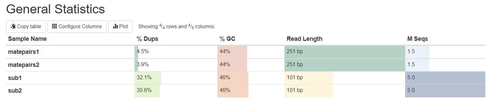
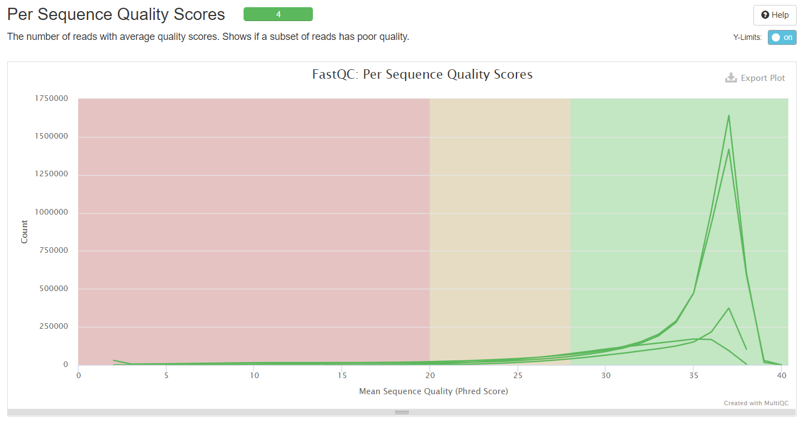
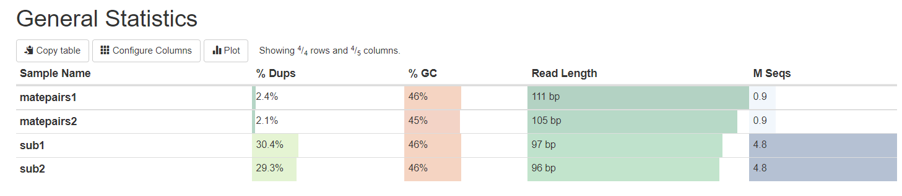
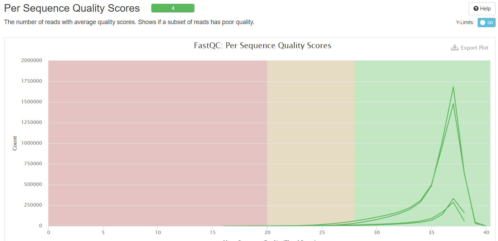

# hse22_hw1

**Выполнил:** Харчиков Игорь, группа 2, ВШЭ НН ИМИКН ПМИ 2

## Обязательная часть

1. Добавим ссылки на данные
```bash
ln -s /usr/share/data-minor-bioinf/assembly/oil_R1.fastq
ln -s /usr/share/data-minor-bioinf/assembly/oil_R2.fastq
ln -s /usr/share/data-minor-bioinf/assembly/oilMP_S4_L001_R2_001.fastq
ln -s /usr/share/data-minor-bioinf/assembly/oilMP_S4_L001_R1_001.fastq
```

2. Используя `RANDOM_SEED=0327` выберем случайно `5e6` чтений типа paired-end и `15e5` чтений типа mate-pairs.
```bash
RANDOM_SEED=0327
seqtk sample -s$RANDOM_SEED oil_R1.fastq 5000000 > sub1.fastq
seqtk sample -s$RANDOM_SEED oil_R2.fastq 5000000 > sub2.fastq
seqtk sample -s$RANDOM_SEED oilMP_S4_L001_R1_001.fastq 1500000 > matepairs1.fastq
seqtk sample -s$RANDOM_SEED oilMP_S4_L001_R2_001.fastq 1500000 > matepairs2.fastq
```

3. С помощью программы `fastQC` и `multiQC` оцениваем качество исходных чтений и выводим по ним общую статистику.
```bash
mkdir fastqc
ls sub* matepairs* | xargs -tI{} fastqc -o fastqc {}
mkdir multiqc
multiqc -o multiqc fastqc
```




1. С помощью программ `platanus_trim` и `platanus_internal_trim` подрезаем чтение по качеству и удаляем адаптеры.
```bash
platanus_trim sub*
platanus_internal_trim matepair*
```

5. Удаляем первоначальные файлы.
```bash
rm sub1.fastq
rm sub2.fastq
rm matepairs1.fastq
rm matepairs2.fastq
```

6. С помощью программ `fastQC` и `multiQC` оцениваем качество подрезанных чтений и получаем по ним общую статистику.
```bash
mkdir fastqc_trim
ls sub* matepairs*| xargs -tI{} fastqc -o fastqc_trim {}
mkdir multiqc_trim
multiqc -o multiqc_trim fastqc_trim
```



1. С помощью программы `platanus assemble` собираем контиги из подрезанных чтений.
```bash
time platanus assemble -o Poil -f sub1.fastq.trimmed sub2.fastq.trimmed 2> assemble.log
```

8. С помощью программы `platanus scaffold` собираем скаффолды из контигов, а также из подрезанных чтений.
```bash
time platanus scaffold -o Poil -c Poil_contig.fa -IP1 sub1.fastq.trimmed sub2.fastq.trimmed -OP2 matepairs1.fastq.int_trimmed matepairs2.fastq.int_trimmed 2> scaffold.log
```

9. Уменьшаем промежутки.
```bash
time platanus gap_close -o Poil -c Poil_scaffold.fa -IP1 sub1.fastq.trimmed sub2.fastq.trimmed -OP2 matepairs1.fastq.int_trimmed  matepairs2.fastq.int_trimmed 2> gapclose.log
```

10. Удаляем подрезанные чтения.
```bash
rm *trimmed
```

Все статистики посчитаны в [Jupyter Notebook](script.ipynb) 

Выводы по контигам: 
* Видные зависимости: рост кол-ва контигов от размера генома, В N50.
* Зависимости длины макс контига от размера не наблюдается.

Выводы по скаффолдам:
* Видные зависимости: убывание длины макс скаффолда, убывание N50, рост кол-ва скаффолдов.
* Зависимости длины гэпов и их кол-ва не наблюдается.

Выводы по скаффолдам без гэпов: 
* Видные зависимости: рост общего количества скаффолдов, убывание N50.
* Зависимости длины скаффолда от размера не наблюдается.
